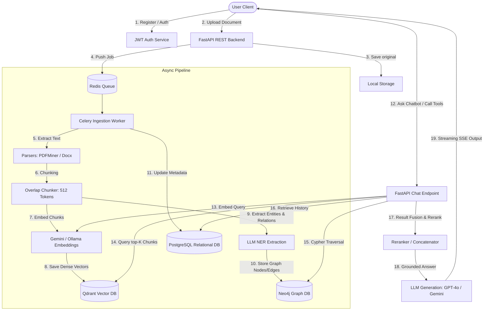

# AI-Powered Knowledge Graph Builder

An enterprise-grade, multi-tenant AI platform that ingests raw documents (PDF, DOCX, XLSX, CSV, JSON, Markdown, TXT) and builds a secure, queryable personal knowledge base. By combining chunk-level dense vector searches (Qdrant) and entity relationship traversals (Neo4j), it powers an intelligent conversational chatbot that outputs grounded answers with source citations. 

Furthermore, the chatbot dynamically leverages custom tool-calling agents to generate charts, compile spreadsheets, summarize documents, build timelines, and render interactive graphs.

---

## 1. System Design & Architecture Overview

The system operates across three distinct phases: **Document Ingestion (Async Pipeline)**, **Hybrid Knowledge Search (Query Processing)**, and **ReAct Tool-Calling (Agent Execution)**.

### High-Level Architecture Diagram


### 1.1 Ingestion Pipeline Steps
1. **Text Extraction**: The celery worker extracts raw text, preserving markdown formatting, headers, and structural layouts.
2. **Chunking**: Splits extracted text into overlapping chunks of 512 tokens with a 50-token overlap to maintain context boundaries.
3. **Embedding Generation**: Chunks are passed to dense embedding models and loaded directly into Qdrant.
4. **Graph extraction**: An LLM parses the chunks to extract Named Entities (People, Orgs, Projects, Locations, Dates) and relationships, registering them as Nodes and Edges in Neo4j.
5. **Metadata Update**: PostgreSQL tracks job queues, tenant-isolation tags (`user_id`), and document processing states (`QUEUED` $\rightarrow$ `PROCESSING` $\rightarrow$ `READY`).

---

## 2. Key Features

### 🔐 Multi-Tenant Data Isolation
Enforces strict security boundaries to prevent cross-contamination between user memory spaces:
* **PostgreSQL**: Filters every metadata query using `WHERE user_id = :current_user`.
* **Qdrant**: Restricts similarity operations using payload filters matching the owner's `user_id`.
* **Neo4j**: Tags every node/relationship with a `userId` property and validates it on Cypher traversals.
* **File Storage**: Segregates uploads into isolated folder structures (`/uploads/{user_id}/{document_id}/`).

### 📂 Multi-Format File Library
Supports batch ingestion of multiple file formats:
* Document formats: `.pdf`, `.docx`, `.txt`, `.md`, `.markdown`
* Data sheets: `.xlsx`, `.csv`, `.json`
* File size limits: Up to 50MB per file with automatic validation on extension and MIME types.

### 🤖 Intelligent Hybrid RAG Chatbot
Uses a unified query processor to extract accurate answers:
* **Semantic Vector Search**: Dense vector matches in Qdrant find contextual paragraphs.
* **Knowledge Graph Traversal**: Relational matching in Neo4j traverses entity mappings.
* **Response Fusion**: Joins and reranks search results to form the context window.
* **Conversational Memory**: Stores message histories in Postgres and passes the last $N$ messages to maintain flow.
* **Citations & Sources**: Grounded responses list files used to generate the answer.

### 🛠️ Callable ReAct Tools
The chatbot dynamically decides to execute tools in response to natural language requests:
* **Chart Generator**: Aggregates tabular metrics and renders interactive line, bar, or pie charts using Plotly.
* **Spreadsheet Export**: Formats extracted documents data into downloadable `.xlsx` or `.csv` spreadsheets.
* **Summary Generator**: Produces detailed bulleted executive summaries of uploaded files.
* **Timeline Builder**: Organizes project milestones or dated events into chronological timelines.
* **Comparison Table**: Compares attributes across files and renders side-by-side tables.
* **Graph Visualizer**: Renders an interactive network of Neo4j entities and relationships.

---

## 3. Directory Structure

```text
ai-knowledge-graph-builder/
├── docker-compose.yml       # Orchestrates frontend, backend, celery, databases, and redis
├── Dockerfile.frontend      # Docker container definition for Next.js/React frontend
├── .env.example             # Environment configuration templates
├── README.md                # Project documentation and guidelines
├── DECISIONS.md             # Architecture Decision Records (ADRs) and trade-offs
├── frontend/                # Next.js SPA Frontend
└── backend/                 # Backend codebase
    ├── Dockerfile           # Backend container definition
    ├── requirements.txt     # Python backend dependencies
    └── app/
        ├── main.py          # FastAPI application server entrypoint
        ├── config.py        # Settings configuration loader (Pydantic Settings)
        ├── dependencies.py  # Shared FastAPI dependencies (auth checks, db sessions)
        ├── core/            # Core utilities (exceptions, security helpers)
        ├── db/              # Databases driver clients (Neo4j, Postgres, Redis)
        ├── api/             # API Router endpoints
        ├── llm/             # LLM provider abstractions & prompt templates
        ├── models/          # SQLAlchemy database model definitions
        ├── schemas/         # Pydantic schema validation models
        ├── retrieval/       # Retrieval layers (semantic search, cypher queries)
        ├── tools/           # Custom callable agent tool implementations
        ├── pipeline/        # Ingestion pipeline worker tasks
        └── utils/           # Helper utilities
```

---

## 4. Port Allocations & Tech Stack

| Service | Technology | Internal Port | External Port | Purpose |
| :--- | :--- | :--- | :--- | :--- |
| **frontend** | React / Next.js | 3000 | 3000 | Web UI for uploading, charting, and chatting |
| **backend** | FastAPI (Python) | 8000 | 8000 | Core REST endpoints and SSE stream handler |
| **celery** | Celery Worker | N/A | N/A | Background task worker for pipeline ingestion |
| **postgres** | PostgreSQL 16 | 5432 | 5432 | Relational structured metadata storage |
| **neo4j** | Neo4j 5 (Community)| 7474, 7687 | 7474, 7687 | Graph network storage for entities and relations |
| **qdrant** | Qdrant Vector DB | 6333, 6334 | 6333, 6334 | Vector similarity search engine |
| **redis** | Redis 7 | 6379 | 6379 | In-memory task queue broker and blacklist storage |

---

## 5. Quick Start (Docker Compose)

### 1. Copy Environment Settings
Duplicate `.env.example` into a new `.env` file in the root directory:
```bash
cp .env.example .env
```

### 2. Launch Services
Run the following command to build and launch all containers:
```bash
docker compose up --build
```
*The backend will automatically wait for postgres, neo4j, qdrant, and redis to report healthy before starting.*

### 3. Verification
* **Frontend Web App**: [http://localhost:3000](http://localhost:3000)
* **Interactive API Documentation (Swagger)**: [http://localhost:8000/docs](http://localhost:8000/docs)
* **System Health Check**: [http://localhost:8000/health](http://localhost:8000/health)

---

## 6. Running Tests Locally

If you are developing locally, you can run the test suite directly on your host machine.

### 1. Setup Virtual Environment & Dependencies
Navigate to the backend directory, activate your virtual environment, and install dependencies:
```bash
cd backend
python -m venv .venv

# On Windows:
.venv\Scripts\activate
# On Linux/macOS:
source .venv/bin/activate

pip install -r requirements.txt
```

### 2. Execute Pytest Suite
Run the testing suite with `PYTHONPATH` set to `backend`:
```bash
# On Windows (PowerShell):
$env:PYTHONPATH="backend"; & .venv/Scripts/pytest backend/tests/

# On Linux/macOS:
PYTHONPATH=backend .venv/bin/pytest backend/tests/
```
*Tests mock external service connections (Redis, Qdrant, Neo4j, LLM Providers) and use an in-memory SQLite database connection dynamically configured for fast execution.*

---

## 7. Study & Learning Disclaimer
This project is built and maintained solely for **educational, study, and learning purposes**. Consequently, no license is attached to this repository. Feel free to explore, modify, and learn from this implementation.

---

### Developed By
**Khushi Koriya**